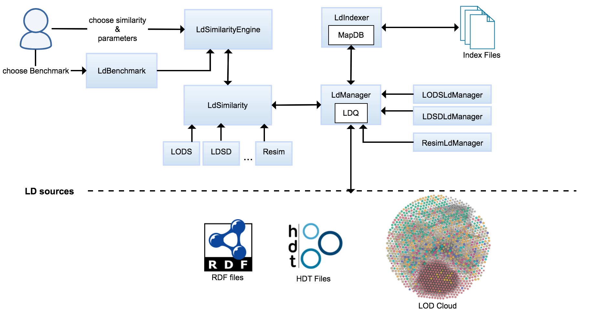

# General Explanation:
**LDS** (Linked Data Similarity) is a JAVA Library for the calculation of **LOD** based semantic similarity.

## Implemented Similarity Measures:
* *LDSD:* Linked Data Semantic Distance [1], and its extensions:
   * *TLDSD:* Typeless Linked Data Semantic Distance [2]
   * *WLDSD:* Weighted Linked Data Semantic Distance [2]
   * *WTLDSD:* Weighted Typeless Linked Data Semantic Distance [2]

* *Resim:* Resource Similarity [3], and its extensions:
  * *TResim:* Typeless Resource Similarity [2]
  * *WResim:* Weighted Resource Similarity [2]
  * *WTResim:* Weighted Typeless Resource Similarity [2]

* *LODS:* Linked Open Data Similarity how to a[4]

* *PICSS:* Partitioned Information Content Semantic Similarity [5]

## Architecture

LDS is madeup of four main components:

### Similarity Engine (LdSimilarityEngine):
The similarity engine is considered the entry point to similarity calculation. The user of the library uses it to specify his desired measure in addition to other configuration parameters. 
The engine orchestrates the whole process of calculation and performs 4 main steps:
* Initializes the similarity measure object chosen by the user in the parameters.

* Loads the necessary index files in case the user wants data indexing, using LdIndexer component.

* Sends concepts to be compared to LdSimilarity component for similarity calculation.

* Receives results from LdSimilarity and returns the similarity value to the user.

In addition to this, LdSimilarityEngine allows the calculation to be done using benchmark files (using LdBenchmark component). In this case, the engine handles the process of reading benchmark input and performing the above steps to produce similarity results outputs. LdSimilarityEngine also supports multithread similarity calculation for a large number of resources to ensure faster delivery of results.

### LOD-based Similarity (LdSimilarity):
Once the engine receives needed information for similarity calculation, it passes them to this component. To perform the similarity calculation, LdSimilarity receives necessary data and applies the algorithm corresponding to the chosen measure.

### Linked data Manager (LdManager):
LdManager acts as an intermediate between LdSimilarity and LdIndexer. Its main function is to retrieve data for similarity calculation by querying data sources chosen by the user. However, when using indexes LdManager is used to update indexes in case data is not previously indexed.

### Linked Data Indexer (LdIndexer):
LdIndexer handles all operations related to indexes. It manages the creation of indexes, data insertion, data retrieval, and handles the process of updating indexes with the help of LdManager.

## References:
[1] Passant, Alexandre. “Measuring Semantic Distance on Linking Data and Using it for Resources Recommendations.” AAAI Spring Symposium: Linked Data Meets Artificial Intelligence (2010).

[2] Alfarhood, Sultan. “Exploiting Semantic Distance in Linked Open Data for Recommendation.” (2017).

[3] Piao, Guangyuan and John G. Breslin. “Measuring semantic distance for linked open data-enabled recommender systems.” SAC '16 (2016).

[4] Cheniki, Nasredine, Abdelkader Belkhir, Yacine Sam and Nizar Messai. “LODS: A Linked Open Data Based Similarity Measure.” 2016 IEEE 25th International Conference on Enabling Technologies: Infrastructure for Collaborative Enterprises (WETICE) (2016): 229-234.

[5] Meymandpour, Rouzbeh, and Davis, J. G. “A semantic similarity measure for linked data: An information content-based approach.” Knowledge-Based Systems, 109, 276–293. https://doi.org/10.1016/j.knosys.2016.07.012 (2016).

