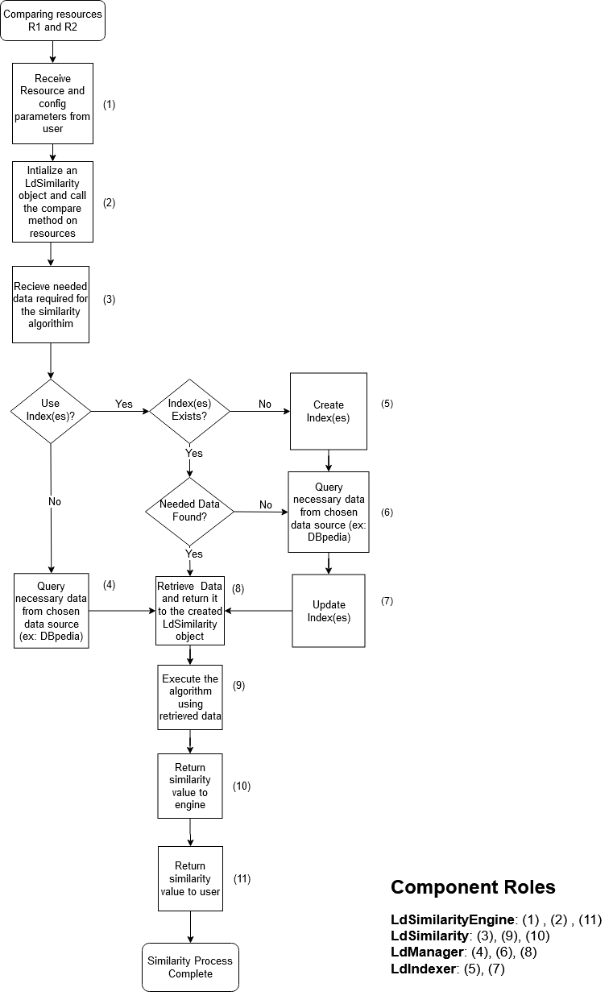

# Similarity Calculation:
To perform a similarity calculation using LDS library a user must first initialize a LdSimilarityEngine object, select the LOD measure wanted, and provide the configuration (config) object which will contain all necessary parameters for a measure to perform the calculation.

The follwoing figure represents a flow chart on how the similarity operation works:

<p align="center">
<!--  -->

</p>

## Code Example:
The following code presents a small example for similarity calculation using Resim similarity measure.
In any calculation case, the steps needed to perform the calculation are:

1- [Initialize the resources](#1-initialize-the-resources-) <br>
2- [Initialize the dataset object](#2-initialize-the-dataset-object-) <br>
3- [Initialize the config object](#3-initialize-the-config-object-) <br>
4- [Initialize the LdSimilarityEngine object](#4-initialize-the-ldsimilarityengine-object-) <br>
5- [Load the engine object](#5-load-the-engine-object-) <br>
6- [Call the similarity method](#6-call-the-similarity-method-) <br>
7- [Close the engine object](#7-close-the-engine-object-)

```java
import lds.engine.LdSimilarityEngine;
import lds.measures.Measure;
import lds.resource.R;
import lds.dataset.LdDatasetCreator;
import slib.utils.i.Conf;

public class ResimTest {
       
    public static void main(String args[]){ 
        
        //initialize two movie resources from DBpedia dataset to calculate the similarity between them
        R r1 = new R("http://dbpedia.org/resource/The_Noah");
        R r2 = new R("http://dbpedia.org/resource/The_Pack_(2010_film)"); 

        //Initialize the main dataset object --- this step is not needed when default config is used.
        LdDataset datasetMain = LdDatasetCreator.getDBpediaDataset();    
        
        //Initialzie the LdSimilarityEngine object
        LdSimilarityEngine engine = new LdSimilarityEngine();
        
        /*Initialize the config object which contains the necessary parameters for the measure
        you can use the default conf as follows. This creates a config with default parameters and no indexing by default*/
        Config config = LdConfigFactory.createDeafaultConf(Measure.Resim);  

        //load the engine with the wanted similarity measure and the config object
        engine.load(Measure.Resim , config);
        
        //calculate the similarity between the two resources
        engine.similarity(r1 , r2);
        
        //ends calculation for the chosen similarity and closes all indexes if created
        engine.close();

   }   
   
}

```

## 1. Initialize the resources:
**Needs:** 
- `import lds.resource.R;`

The first step in the similarity calculation process is to initialize the two resources that will be compared. To do so the R class is used. In this example we are using two movie resources from DBpedia dataset:

`R r1 = new R("http://dbpedia.org/resource/The_Noah");` 

**Note:** The url of each resource changes according to the dataset its found in

- - - 


## 2. Initialize the dataset object:
**Needs:**
- `import lds.dataset.LdDatasetCreator;`

To perform the similarity calculation a user must initialize the dataset object from which necessary data for calculation will be queried using SPARQL. To do so the LdDatasetCreator class is used as follows:

`LdDataset datasetMain = LdDatasetCreator.getDBpediaDataset();` 

The above command creates an object of the english chapter DBpedia. Specifiying the DBpedia chapter (ex: `LdDatasetCreator.getDBpediaDataset(DBpediaChapter.fr);`) as a parameter is required if another chapter is wanted.

**Note:** 
- To create an object of a remote dataset other than DBpedia, use the `LdDatasetCreator.getRemoteDataset(service , defaultGraph , name)` method where `service` is a string representing the URI of the remote endpoint, `defaultGraph` is a string representing the default graph URI, and `name` is a string represeting the name of the dataset which can be any value. <br>
- This step is not required if the user will use the default config object for the measure (see section [Initialize the config object](#3-initialize-the-config-object-)). The default config object will use the english Dbpedia chapter by default. <br>
- Using weighted measures such as: WLDSD_cw, WTLDSD_cw, WResim, WTResim requires an extra dataset (LdDatasetSpecific) which is used to calculate weights for links.

- - - 

## 3. Initialize the config object:
**Needs:** 
- `import lds.config.Config;`

A config object holds all the necessary configurations for a similarity measure to perform the calculation. To initialize a config object the Config class is needed, this class is based on the Conf class from [slib](http://www.semantic-measures-library.org) library.

A config object can be initialized in sevral ways:

1- Using LdConfigFactory class where you create a default config object with the basic parameters:

`Config config = LdConfigFactory.createDeafaultConf(Measure.Resim);`

The  `createDeafaultConf()` takes the wanted measure as a parameter and creates the basic config object for it. Using this method however, requires adding some new parameters for some measures which can't be created by default.

2- Creating the config object and manually passing all the needed parameters fo a measure. In this case for example, Resim needs the main dataset and to specify    wether indexing is needed or not:

`Config config = new Config();` <br>
`config.addParam(ConfigParam.LdDatasetMain , dataset); ` <br>
`config.addParam(ConfigParam.useIndexes , false);`

**Note:**
- Each similairty measure require its own config parameters to be defined before calculation.
- To make it easier for the user to add parameters, the ConfigParam enum is created. addParam() method takes as parameters a ConfigParam parameter name and the object needed. The necessary paarmeters for each measure are explained [here](./Similarity_Measures_Configuration_Parameters.md).

- - - 

## 4. Initialize the LdSimilarityEngine object:
**Needs:**
- `import lds.engine.LdSimilarityEngine;`

An engine object is the object needed to perform the similarity calculation by the desired measure. An engine object is initialized using LdSimilarityEngine class as follows:

`LdSimilarityEngine engine = new LdSimilarityEngine();`

- - - 


## 5. Load the engine object:
**Needs:**
- `import lds.measures.Measure;`

Loading the engine object specifies for the engine what is the wanted measure for calculation and what are the configuartion parameters needed for the measure. In this example we are calculating the similairty using Resim similairty measure as follows:

`engine.load(Measure.Resim , config);`

- - - 


## 6. Call the similarity method:
Calling the 'similarity' method calculates the similairty between two given resources and returns a double representing the similairty between them:

`engine.similarity(r1 , r2);`

**Note:** 

- You can perform more than one similairty calculation using the same similarity measure before closing the engine.
- Changing the similairty measure, requires: <br>
    1- Closing the enigne <br>
    2- Loading it with the new measure and updated config object if necessary <br>
    3- Closing it after calculation. 

- - - 

## 7. Close the engine object:
Closing the engine object ensures that all necessary indexes needed are closed properly. It is advisable to always close the engine after similairt calculation:

`engine.close();`